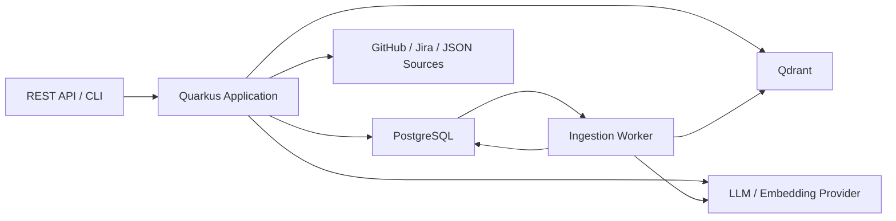
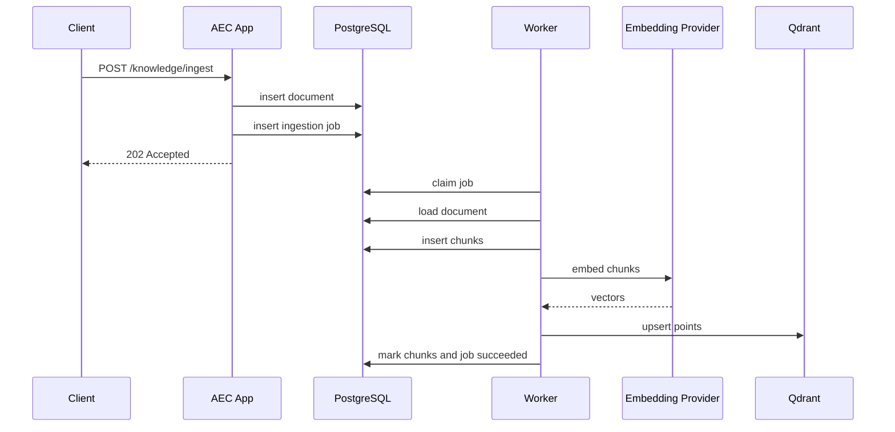
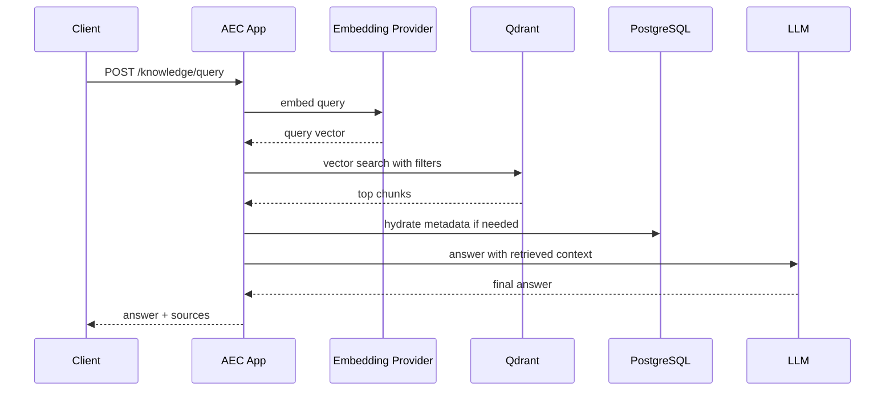

# AEC V2 Architecture: PostgreSQL + Qdrant + Postgres Queue

## Status

Proposed target architecture for the next implementation phase.

## Context

AEC currently demonstrates three core engineering workflows:

- PR review
- multi-source ticket analysis
- engineering knowledge retrieval

The current codebase is intentionally MVP-shaped. It supports mock-first execution, an in-memory knowledge repository, and clean interface boundaries, but it does not yet persist core application data or support queued knowledge ingestion.

This design defines the next durable architecture:

- PostgreSQL as the canonical application datastore
- Qdrant as the vector retrieval index
- PostgreSQL-backed job queue for asynchronous knowledge ingestion

## Goals

- keep one clear source of truth for operational data
- learn a modern vector-native retrieval stack
- support recovery and retries for ingestion
- preserve clear ownership boundaries
- avoid unnecessary service sprawl
- stay operable in local development and portfolio/demo environments

## Non-Goals

- splitting AEC into multiple deployable services
- introducing Kafka or RabbitMQ for MVP queueing
- making Qdrant the canonical document store
- implementing every possible source integration up front

## Architecture Summary

### Recommendation

Run one Quarkus application backed by:

- PostgreSQL for canonical application state
- Qdrant for vector similarity search
- a PostgreSQL job table for asynchronous ingestion

### Why this shape

- application records are relational and transactional
- retrieval data is vector-first and benefits from vector-native indexing
- queueing for ingestion is workflow orchestration, not high-throughput event streaming
- one app with strong modules is the right complexity level for this project

## Source Of Truth

### PostgreSQL owns

- normalized tickets
- ticket comments
- ticket analyses
- pull request snapshots
- PR files
- PR review outputs
- knowledge documents
- knowledge chunks
- ingestion jobs and attempts
- optional raw source payload snapshots

### Qdrant owns

- vector indexes for knowledge chunks
- retrieval payloads used for vector filtering
- nearest-neighbor search execution

### Important rule

Qdrant is a derived index, not the canonical content store.

If Qdrant data is lost, the system must be able to rebuild it from PostgreSQL.

## System Diagram



## Module Boundaries

Keep one deployable app, but split the code into these ownership areas:

- `review`
  - PR fetch, normalization, review generation, persistence
- `ticket`
  - ticket source adapters, normalization, analysis generation, persistence
- `knowledge`
  - document ingest API, chunking, retrieval, answer synthesis
- `jobs`
  - queueing, leasing, retries, dead-letter handling
- `infra-postgres`
  - database repositories and migrations
- `infra-qdrant`
  - vector repository and collection lifecycle
- `infra-llm`
  - chat and embedding providers
- `infra-integrations`
  - GitHub, Jira, JSON

## Data Model

### `ticket`

- `id uuid primary key`
- `source_type text not null`
- `source_ref text not null`
- `title text not null`
- `description text`
- `normalized_status text`
- `raw_payload jsonb`
- `fetched_at timestamptz not null`
- `created_at timestamptz not null default now()`

Constraint:

- unique `(source_type, source_ref)`

### `ticket_comment`

- `id uuid primary key`
- `ticket_id uuid not null references ticket(id) on delete cascade`
- `author text`
- `body text not null`
- `source_comment_ref text`
- `created_at timestamptz`

### `ticket_analysis`

- `id uuid primary key`
- `ticket_id uuid not null references ticket(id)`
- `provider text not null`
- `model text not null`
- `summary text not null`
- `risks jsonb not null`
- `missing_info jsonb not null`
- `dependencies jsonb not null`
- `status text not null`
- `created_at timestamptz not null default now()`

### `pull_request`

- `id uuid primary key`
- `source_type text not null default 'github'`
- `source_ref text not null`
- `repo_owner text not null`
- `repo_name text not null`
- `pr_number integer not null`
- `title text not null`
- `description text`
- `author text`
- `base_branch text`
- `head_branch text`
- `raw_payload jsonb`
- `fetched_at timestamptz not null`
- `created_at timestamptz not null default now()`

Constraint:

- unique `(repo_owner, repo_name, pr_number)`

### `pull_request_file`

- `id uuid primary key`
- `pull_request_id uuid not null references pull_request(id) on delete cascade`
- `path text not null`
- `status text not null`
- `additions integer not null`
- `deletions integer not null`
- `patch_text text`

### `pr_review`

- `id uuid primary key`
- `pull_request_id uuid not null references pull_request(id)`
- `provider text not null`
- `model text not null`
- `summary text not null`
- `issues jsonb not null`
- `suggestions jsonb not null`
- `status text not null`
- `created_at timestamptz not null default now()`

### `knowledge_document`

- `id uuid primary key`
- `source_type text not null`
- `source_ref text`
- `title text not null`
- `content text not null`
- `content_hash text not null`
- `metadata jsonb not null default '{}'::jsonb`
- `ingestion_status text not null`
- `latest_job_id uuid`
- `created_at timestamptz not null default now()`
- `updated_at timestamptz not null default now()`

Constraint:

- unique `(source_type, source_ref, content_hash)`

### `knowledge_chunk`

- `id uuid primary key`
- `document_id uuid not null references knowledge_document(id) on delete cascade`
- `chunk_index integer not null`
- `chunk_text text not null`
- `token_count integer`
- `embedding_model text`
- `embedding_status text not null`
- `qdrant_point_id text`
- `metadata jsonb not null default '{}'::jsonb`
- `created_at timestamptz not null default now()`
- `updated_at timestamptz not null default now()`

Constraint:

- unique `(document_id, chunk_index)`

### `ingestion_job`

- `id uuid primary key`
- `job_type text not null`
- `target_type text not null`
- `target_id uuid not null`
- `status text not null`
- `priority integer not null default 100`
- `payload jsonb not null`
- `scheduled_at timestamptz not null default now()`
- `leased_until timestamptz`
- `leased_by text`
- `attempt_count integer not null default 0`
- `max_attempts integer not null default 5`
- `last_error text`
- `created_at timestamptz not null default now()`
- `updated_at timestamptz not null default now()`

Indexes:

- `(status, scheduled_at, priority)`
- `(target_type, target_id)`

### `ingestion_job_attempt`

- `id uuid primary key`
- `job_id uuid not null references ingestion_job(id) on delete cascade`
- `attempt_number integer not null`
- `started_at timestamptz not null`
- `finished_at timestamptz`
- `outcome text not null`
- `error_message text`

## Queueing Design

### Recommendation

Use a PostgreSQL-backed job queue implemented with row leasing and `FOR UPDATE SKIP LOCKED`.

### Why not Kafka or RabbitMQ now

- Kafka would add too much operational weight for this stage
- RabbitMQ would add another stateful dependency without enough leverage
- ingestion is background workflow processing, not high-scale event streaming
- a Postgres queue keeps the write path and the queue in one transaction boundary

### Lease pattern

The worker polls for jobs with:

```sql
select id
from ingestion_job
where status = 'pending'
  and scheduled_at <= now()
order by priority asc, scheduled_at asc
for update skip locked
limit 1;
```

Then:

1. mark job `running`
2. set `leased_until`
3. increment `attempt_count`
4. execute work
5. mark `succeeded` or schedule retry

### Initial job types

- `knowledge_document_ingest`

Later:

- `knowledge_chunk_embed`
- `knowledge_reindex`
- `ticket_refresh`
- `pull_request_refresh`

## Qdrant Design

### Collection strategy

Start with one collection:

- `knowledge_chunks`

### Why one collection first

- simplest operational model
- easiest cross-source retrieval
- lowest query routing complexity
- good enough while one embedding model is used

### Payload fields

- `chunk_id`
- `document_id`
- `source_type`
- `source_ref`
- `title`
- `document_type`
- `repo`
- `path`
- `tags`
- `language`
- `version`
- `created_at`

### Retrieval model

Query flow:

1. embed query
2. search Qdrant with top-k and payload filters
3. optionally hydrate authoritative metadata from Postgres
4. build RAG context
5. call LLM

## API Design Changes

### `POST /knowledge/ingest`

Change from synchronous success to queued response.

Response:

```json
{
  "document_id": "uuid",
  "job_id": "uuid",
  "status": "queued"
}
```

### Add endpoints

- `GET /knowledge/documents/{id}`
- `GET /jobs/{id}`
- optional later: `POST /jobs/{id}/retry`

## Sequence Flows

### Knowledge ingestion



### Knowledge query



## Failure Modes

### Postgres write succeeds, Qdrant write fails

Mitigation:

- keep Postgres canonical
- retry using pending or failed chunk/job status

### Worker crashes mid-job

Mitigation:

- lease expiration via `leased_until`
- reclaim abandoned jobs

### Duplicate ingest requests

Mitigation:

- dedupe on `content_hash`
- make Qdrant upsert idempotent with stable chunk IDs

### Qdrant contains stale vectors after document update

Mitigation:

- version payloads
- delete or replace points by `document_id`

### Hidden coupling to external payload shape

Mitigation:

- treat raw payloads as audit artifacts only
- keep normalized internal models authoritative

## Tradeoffs

### Postgres + Qdrant

Pros:

- strong separation between canonical data and retrieval index
- high learning value
- realistic RAG architecture
- recoverable indexing model

Cons:

- two stateful systems instead of one
- more operational complexity
- requires explicit sync and retry logic

### Postgres queue

Pros:

- simple
- transactional
- easy local development
- no third system to operate

Cons:

- polling overhead
- weaker scaling ceiling than Kafka
- fewer broker-native delivery features

### Raw payload persistence

Pros:

- debugging
- auditability
- reprocessing

Cons:

- more storage
- stronger privacy and retention concerns

## Operational Requirements

### Metrics

- queued jobs
- running jobs
- failed jobs
- dead-letter jobs
- ingest latency
- embedding latency
- Qdrant upsert latency
- query latency
- retrieval result count

### Health checks

- app liveness
- Postgres readiness
- Qdrant readiness
- optional embedding-provider readiness

### Logging

Every background workflow log line should include:

- `job_id`
- `document_id`
- `provider`
- `attempt_count`
- `chunk_count`

## Recommended Migration Path

1. Add Flyway and Postgres schema.
2. Introduce persisted repositories for tickets, PRs, and analyses.
3. Add knowledge document and chunk persistence in Postgres.
4. Add job queue tables and worker polling.
5. Add Qdrant vector repository.
6. Change `/knowledge/ingest` to `202 Accepted`.
7. Add job status and document status endpoints.

## Decision Summary

Use:

- one Quarkus app
- PostgreSQL as canonical datastore
- PostgreSQL-backed queue for ingestion
- Qdrant as vector index
- one `knowledge_chunks` collection
- normalized internal records plus raw payload snapshots

This is the best balance of clarity, operability, learning value, and implementation realism for AEC.
